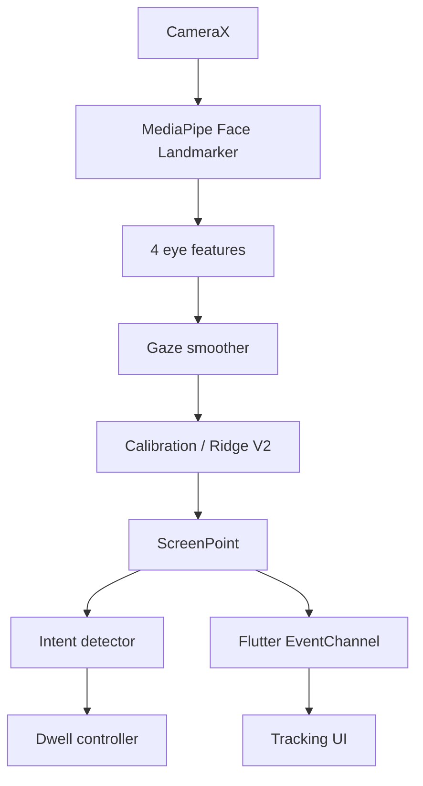

# NewVision

On-device Android eye-control system built with Flutter, Kotlin, CameraX and MediaPipe.

## Product

NewVision turns gaze into a screen point and optional dwell interaction while keeping camera processing on-device. The Flutter layer provides onboarding, permissions, calibration, tracking, settings and diagnostics.

## Architecture



## Screens

- Splash
- Onboarding
- Permissions / readiness
- Home
- Calibration
- Tracking
- Settings
- About

Arabic and English UI are supported with RTL/LTR switching and persisted preferences.

## Build

```bash
flutter pub get
flutter analyze
flutter test --coverage
cd android
gradle --no-daemon test
gradle --no-daemon :app:assembleDebug
```

Release builds use ABI splits, R8/resource shrinking and Android v1+v2 signing.

## Privacy

Camera frames are processed locally. See [docs/PRIVACY.md](docs/PRIVACY.md).

## Documentation

- [Architecture](docs/ARCHITECTURE.md)
- [Calibration](docs/CALIBRATION.md)
- [API](docs/API.md)
- [Performance](docs/PERFORMANCE.md)
- [Troubleshooting](docs/TROUBLESHOOTING.md)
- [Arabic user guide](docs/USER_GUIDE.md)
- [Changelog](docs/CHANGELOG.md)
- [Contributing](docs/CONTRIBUTING.md)
