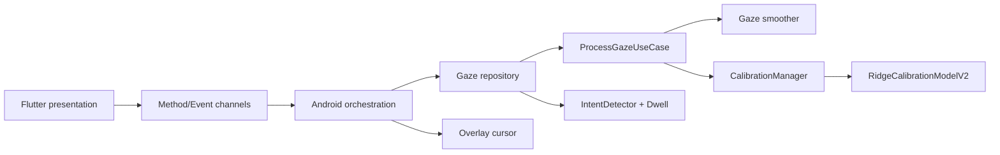

# Architecture

NewVision follows a layered architecture.

### Contracts

- `GazeSample` is the native camera-domain input.
- `ScreenPoint` is the single output contract consumed by cursor and decision layers.
- Flutter receives `ScreenPoint` through `com.eyecontrol/gaze_screen_point`.
- Calibration V2 consumes exactly four eye features and persists ten model coefficients.
- Blink samples freeze the last valid position without poisoning timestamp history.
